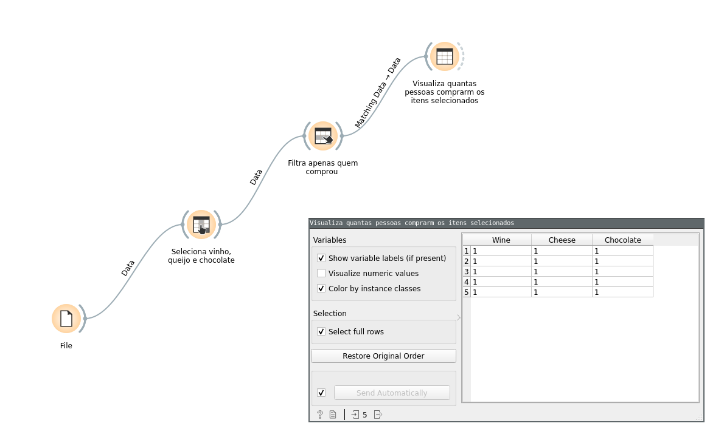

# Projeto Orange / Regras de Associação para Foodmart

> A ferramenta pode ser utilizada para identificar, por exemplo, quantos clientes 
> realizaram a compra de itens específicos em conjunto. 
> No exemplo abaixo, foi realizado um filtro que identifica quantos clientes compraram  
> os itens *vinho, queijo e chocolate* dentre todos os outros itens comprados.

## Imagem do Projeto

## Arquivo do Projeto

# Projeto Orange / Análise de Dados do Google PlayStore

## Imagem do Projeto
> Coloque uma imagem da captura de tela com o projeto do Orange.

## Arquivo do Projeto
> Coloque um link para o arquivo em Orange.

## Gráfico(s) de Análise
> Apresente a seguir o(s) gráfico(s) de análise produzidos (se houver) com legendas.

# Projeto de Composição de Componentes para Recomendação

> Imagem (`PNG`) do diagrama de componentes (veja exemplos abaixo).

# Projeto de Composição de Componentes para Pedido

## Diagrama de Componentes

> Imagem (`PNG`) do diagrama de componentes do pedido de um produto (veja exemplos abaixo).

## Diagrama de Interfaces

> Imagem (`PNG`) do detalhamento de interfaces referentes aos componentes.

