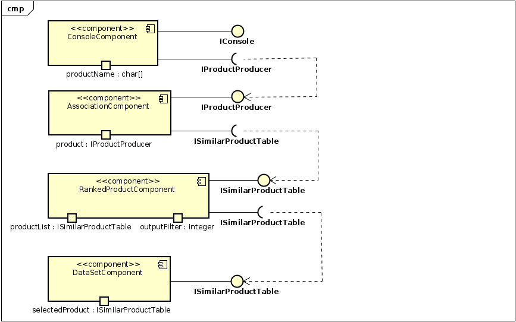

# Projeto Orange / Regras de Associação para Foodmart

> A ferramenta pode ser utilizada para identificar, por exemplo, quantos clientes 
> realizaram a compra de itens específicos em conjunto. 
> No exemplo abaixo, foi realizado um filtro que identifica quantos clientes compraram  
> os itens *vinho, queijo e chocolate* dentre todos os outros itens comprados.< br/>
> É possível verificar no association rules da ferramenta a quantidade pequena de pessoas 
> que realizou a compra dos 3 itens especificados.

## Imagem do Projeto

## Arquivo do Projeto
[Associação - Vinho, queijo e chocolate](orange/tarefa-foodmart.ows)

# Projeto Orange / Análise de Dados do Google PlayStore

> Com a análise abaixo, foi possível perceber uma correlação entre preço e avaliações 
> existentes dentro do dataset. É possível identificar que, na maioria dos casos, as aplicações 
> gratuitas não possuem muitas avaliações. 

## Imagem do Projeto

## Arquivo do Projeto
[Associação - Preço, categoria e avaliações](orange/tarefa_googleplay.ows)

## Gráfico(s) de Análise

# Projeto de Composição de Componentes para Recomendação
- **ConsoleComponent** > 
Este componente recebe o input do usuário com o nome do produto que ele deseja comprar 
e gera uma interface do tipo IProductProducer que é utilizada dentro do sistema. 
- **AssociationComponent** >
Este componente é responsável por receber o produto selecionado e realizar as regras de associação 
necessárias para escolher produtos similares. Gera um ISimilarProductTable com a lista de produtos 
similares 
- **RankedProductComponent** >
Este componente recebe a interface de produtos similares contendo a lista completa e realiza  
o rankeamento dos produtos. Sua saída é a mesma interface (ISimilarProductTable), entretanto com  
limitação do tamanho da lista sendo configurada pelo parâmetro outputFilter. 
- **DataSetComponent** > 
Este componente é o dataset gerado para entregar o resultado requerido.

# Projeto de Composição de Componentes para Pedido

## Diagrama de Componentes

> Imagem (`PNG`) do diagrama de componentes do pedido de um produto (veja exemplos abaixo).

## Diagrama de Interfaces

> Imagem (`PNG`) do detalhamento de interfaces referentes aos componentes.

