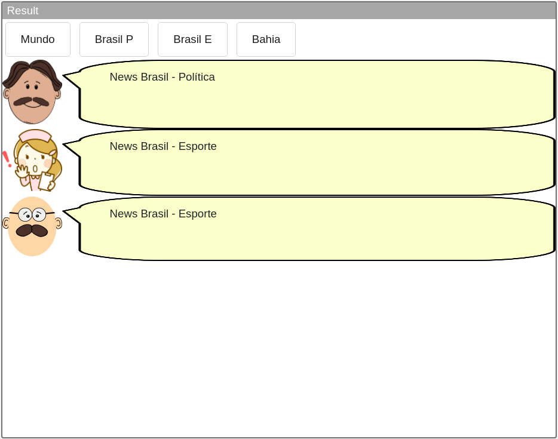
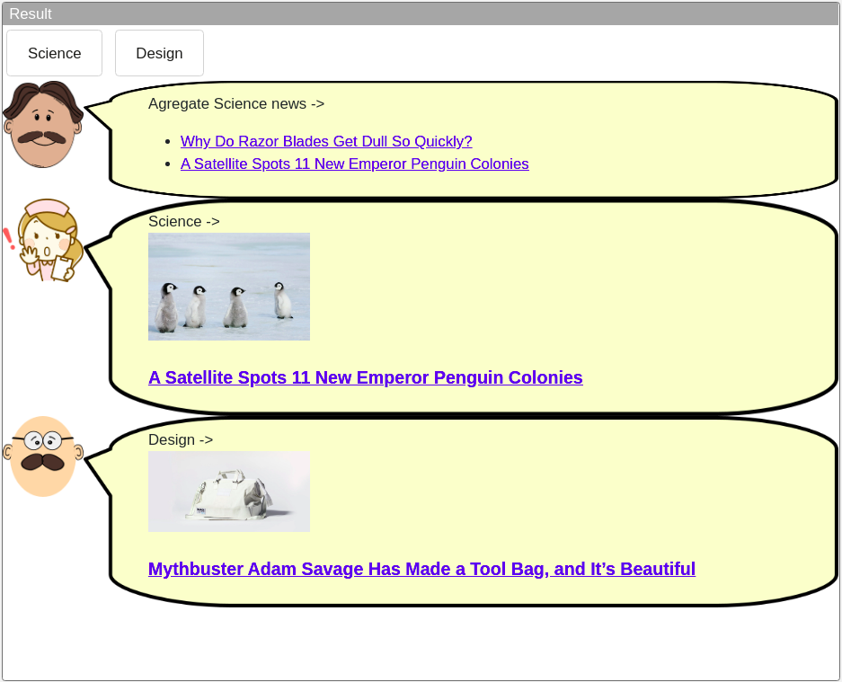

# Tarefa Componentes

# tarefa 01
```python
import pt.c08componentes.s20catalog.s10ds.*;
import pt.c08componentes.s20catalog.s20console.*;
import pt.c08componentes.s20catalog.s30projection.*;

IDataSet dataSet = new DataSetComponent();
dataSet.setDataSource("../../../db/zombie/zombie-health-spreadsheet.csv");

IProjection projection = new ProjectionComponent();
projection.connect(dataSet);
String[] filter = {"name", "age"};
projection.setAttributes(filter);

IConsole console = new ConsoleComponent();
console.connect(projection);
console.update();
```


# tarefa 02
```python
import pt.c08componentes.s20catalog.s10ds.*;
import pt.c08componentes.s20catalog.s20console.*;
import pt.c08componentes.s20catalog.s40selection.*;

IDataSet dataSet = new DataSetComponent();
dataSet.setDataSource("../../../db/zombie/zombie-health-spreadsheet.csv");

ISelection selection = new SelectionComponent();
selection.connect(dataSet);
selection.setOperator("=");
selection.setAttribute("diagnostic");
selection.setValue("bacterial_infection");
selection.setNominalComparison(true);

IConsole console = new ConsoleComponent();
console.connect(selection);
console.update();
```


# tarefa 03
```python
import pt.c08componentes.s20catalog.s10ds.*;
import pt.c08componentes.s20catalog.s20console.*;
import pt.c08componentes.s20catalog.s40selection.*;
import pt.c08componentes.s20catalog.s30projection.*;

IDataSet dataSet = new DataSetComponent();
dataSet.setDataSource("../../../db/zombie/zombie-health-spreadsheet.csv");

ISelection selection = new SelectionComponent();
selection.connect(dataSet);
selection.setOperator("=");
selection.setAttribute("diagnostic");
selection.setValue("bacterial_infection");
selection.setNominalComparison(true);

IProjection projection = new ProjectionComponent();
projection.connect(selection);
String[] filter = {"name", "age"};
projection.setAttributes(filter);

IConsole console = new ConsoleComponent();
console.connect(projection);
console.update();
```


# tarefa 04
```python
import pt.c08componentes.s20catalog.s10ds.*;
import pt.c08componentes.s20catalog.s30projection.*;
import pt.c08componentes.s20catalog.s50chart.IChart;

IDataSet dataSet = new DataSetComponent();
dataSet.setDataSource("../../../db/zombie/zombie-health-spreadsheet.csv");

IProjection projection = new ProjectionComponent();
projection.connect(dataSet);
String[] filter = {"days_recovery", "age"};
projection.setAttributes(filter);

IChart chart = new ChartBubbleComponent();
chart.connect(projection);
chart.setTitle("Zombie Health");
chart.setXTitle("Days Recovery");
chart.setYTitle("Age");

chart.start();
```


# tarefa 05
```python
import pt.c08componentes.s20catalog.s10ds.*;
import pt.c08componentes.s20catalog.s30projection.*;
import pt.c08componentes.s20catalog.s50chart.IChart;

IDataSet dataSet = new DataSetComponent();
dataSet.setDataSource("../../../db/zombie/zombie-health-spreadsheet.csv");

IProjection projection = new ProjectionComponent();
projection.connect(dataSet);
String[] filter = {"days_recovery", "age", "diagnostic"};
projection.setAttributes(filter);

IChart chart = new ChartBubbleComponent();
chart.connect(projection);
chart.setTitle("Zombie Health");
chart.setXTitle("Days Recovery");
chart.setYTitle("Age");

chart.start();
```


# tarefa 06
```python
import pt.c08componentes.s20catalog.s10ds.*;
import pt.c08componentes.s20catalog.s30projection.*;
import pt.c08componentes.s20catalog.s40selection.*;
import pt.c08componentes.s20catalog.s50chart.IChart;

IDataSet dataSet = new DataSetComponent();
dataSet.setDataSource("../../../db/zombie/zombie-health-spreadsheet.csv");

ISelection selection = new SelectionComponent();
selection.connect(dataSet);
selection.setOperator("=");
selection.setAttribute("diagnostic");
selection.setValue("bacterial_infection");
selection.setNominalComparison(true);

IProjection projection = new ProjectionComponent();
projection.connect(selection);
String[] filter = {"days_recovery", "age"};
projection.setAttributes(filter);

IChart chart = new ChartBubbleComponent();
chart.connect(projection);
chart.setTitle("Zombie Health");
chart.setXTitle("Days Recovery");
chart.setYTitle("Age");

chart.start();
```


# DCC Playground

## tarefa 01
```html
<dcc-trigger label="Mundo" action="noticia/mundo/politica" value="Mundo - Política">
</dcc-trigger>

<dcc-trigger label="Brasil P" action="noticia/brasil/politica" value="Brasil - Política">
</dcc-trigger>

<dcc-trigger label="Brasil E" action="noticia/brasil/esporte" value="Brasil - Esporte">
</dcc-trigger>

<dcc-trigger label="Bahia" action="noticia/bahia/esporte" value="Bahia - Esporte">
</dcc-trigger>

<dcc-lively-talk id="doctor"
                 duration="0s"
                 character="doctor"
                 speech="News ">
  <subscribe-dcc topic="#/politica"></subscribe-dcc>
</dcc-lively-talk>

<dcc-lively-talk id="nurse"
                 duration="0s"
                 character="nurse"
                 speech="News ">
  <subscribe-dcc topic="#/brasil/#"></subscribe-dcc>
  <subscribe-dcc topic="#/bahia/#"></subscribe-dcc>
</dcc-lively-talk>

<dcc-lively-talk id="patient"
                 duration="0s"
                 character="patient"
                 speech="News ">
  <subscribe-dcc topic="#"></subscribe-dcc>
</dcc-lively-talk>
```


## tarefa 02
```html
<dcc-rss publish="rss/science" source="https://www.wired.com/category/science/feed">
  <subscribe-dcc topic="next_science/rss" role="step"></subscribe-dcc>
</dcc-rss>
<dcc-rss publish="rss/design" source="https://www.wired.com/category/design/feed">
  <subscribe-dcc topic="next_design/rss" role="step"></subscribe-dcc>
</dcc-rss>

<dcc-aggregator publish="aggregate/science" quantity="2">
  <subscribe-dcc topic="rss/science"></subscribe-dcc>
</dcc-aggregator>

<dcc-trigger label="Science" action="next_science/rss">
</dcc-trigger>
<dcc-trigger label="Design" action="next_design/rss">
</dcc-trigger>

<dcc-lively-talk id="doctor"
                 duration="0s"
                 character="doctor"
                 speech="Agregate Science news -> ">
  <subscribe-dcc topic="aggregate/science"></subscribe-dcc>
</dcc-lively-talk>

<dcc-lively-talk id="nurse"
                 duration="0s"
                 character="nurse"
                 speech="Science -> ">
  <subscribe-dcc topic="rss/science"></subscribe-dcc>
</dcc-lively-talk>

<dcc-lively-talk id="patient"
                 duration="0s"
                 character="patient"
                 speech="Design -> ">
  <subscribe-dcc topic="rss/design"></subscribe-dcc>
</dcc-lively-talk>
```
