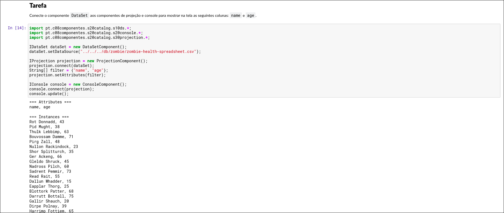
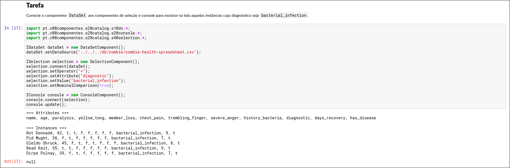
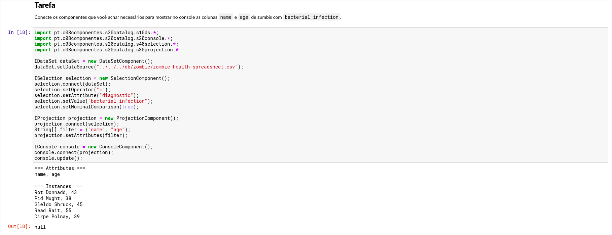
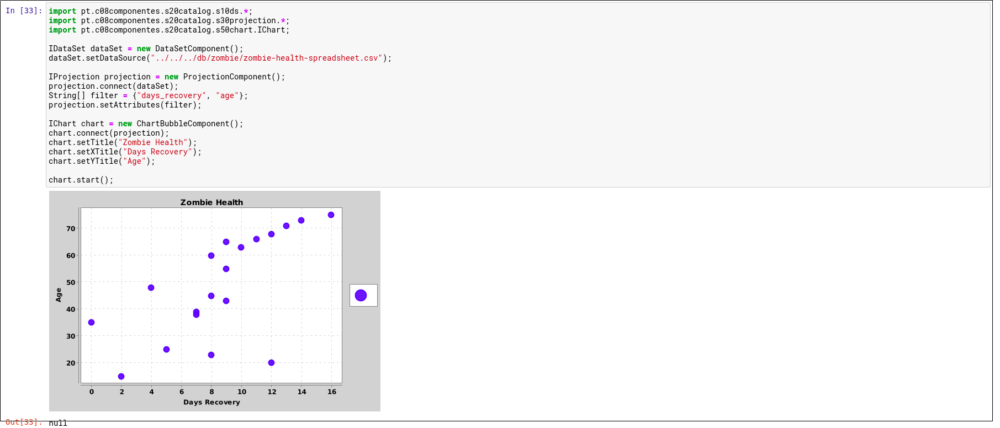
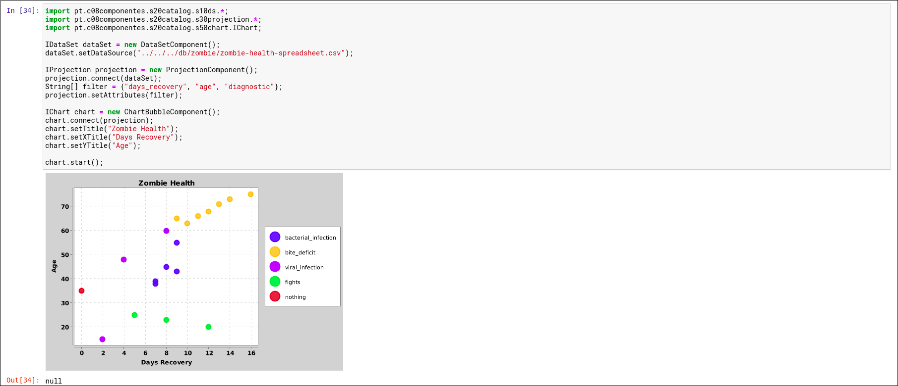
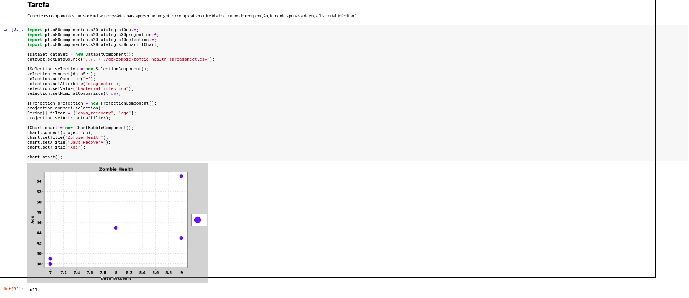

# Tarefa Componentes

# tarefa 01
```python
import pt.c08componentes.s20catalog.s10ds.*;
import pt.c08componentes.s20catalog.s20console.*;
import pt.c08componentes.s20catalog.s30projection.*;

IDataSet dataSet = new DataSetComponent();
dataSet.setDataSource("../../../db/zombie/zombie-health-spreadsheet.csv");

IProjection projection = new ProjectionComponent();
projection.connect(dataSet);
String[] filter = {"name", "age"};
projection.setAttributes(filter);

IConsole console = new ConsoleComponent();
console.connect(projection);
console.update();
```


# tarefa 02
```python
import pt.c08componentes.s20catalog.s10ds.*;
import pt.c08componentes.s20catalog.s20console.*;
import pt.c08componentes.s20catalog.s40selection.*;

IDataSet dataSet = new DataSetComponent();
dataSet.setDataSource("../../../db/zombie/zombie-health-spreadsheet.csv");

ISelection selection = new SelectionComponent();
selection.connect(dataSet);
selection.setOperator("=");
selection.setAttribute("diagnostic");
selection.setValue("bacterial_infection");
selection.setNominalComparison(true);

IConsole console = new ConsoleComponent();
console.connect(selection);
console.update();
```


# tarefa 03
```python
import pt.c08componentes.s20catalog.s10ds.*;
import pt.c08componentes.s20catalog.s20console.*;
import pt.c08componentes.s20catalog.s40selection.*;
import pt.c08componentes.s20catalog.s30projection.*;

IDataSet dataSet = new DataSetComponent();
dataSet.setDataSource("../../../db/zombie/zombie-health-spreadsheet.csv");

ISelection selection = new SelectionComponent();
selection.connect(dataSet);
selection.setOperator("=");
selection.setAttribute("diagnostic");
selection.setValue("bacterial_infection");
selection.setNominalComparison(true);

IProjection projection = new ProjectionComponent();
projection.connect(selection);
String[] filter = {"name", "age"};
projection.setAttributes(filter);

IConsole console = new ConsoleComponent();
console.connect(projection);
console.update();
```


# tarefa 04
```python
import pt.c08componentes.s20catalog.s10ds.*;
import pt.c08componentes.s20catalog.s30projection.*;
import pt.c08componentes.s20catalog.s50chart.IChart;

IDataSet dataSet = new DataSetComponent();
dataSet.setDataSource("../../../db/zombie/zombie-health-spreadsheet.csv");

IProjection projection = new ProjectionComponent();
projection.connect(dataSet);
String[] filter = {"days_recovery", "age"};
projection.setAttributes(filter);

IChart chart = new ChartBubbleComponent();
chart.connect(projection);
chart.setTitle("Zombie Health");
chart.setXTitle("Days Recovery");
chart.setYTitle("Age");

chart.start();
```


# tarefa 05
```python
import pt.c08componentes.s20catalog.s10ds.*;
import pt.c08componentes.s20catalog.s30projection.*;
import pt.c08componentes.s20catalog.s50chart.IChart;

IDataSet dataSet = new DataSetComponent();
dataSet.setDataSource("../../../db/zombie/zombie-health-spreadsheet.csv");

IProjection projection = new ProjectionComponent();
projection.connect(dataSet);
String[] filter = {"days_recovery", "age", "diagnostic"};
projection.setAttributes(filter);

IChart chart = new ChartBubbleComponent();
chart.connect(projection);
chart.setTitle("Zombie Health");
chart.setXTitle("Days Recovery");
chart.setYTitle("Age");

chart.start();
```


# tarefa 06
```python
import pt.c08componentes.s20catalog.s10ds.*;
import pt.c08componentes.s20catalog.s30projection.*;
import pt.c08componentes.s20catalog.s40selection.*;
import pt.c08componentes.s20catalog.s50chart.IChart;

IDataSet dataSet = new DataSetComponent();
dataSet.setDataSource("../../../db/zombie/zombie-health-spreadsheet.csv");

ISelection selection = new SelectionComponent();
selection.connect(dataSet);
selection.setOperator("=");
selection.setAttribute("diagnostic");
selection.setValue("bacterial_infection");
selection.setNominalComparison(true);

IProjection projection = new ProjectionComponent();
projection.connect(selection);
String[] filter = {"days_recovery", "age"};
projection.setAttributes(filter);

IChart chart = new ChartBubbleComponent();
chart.connect(projection);
chart.setTitle("Zombie Health");
chart.setXTitle("Days Recovery");
chart.setYTitle("Age");

chart.start();
```
