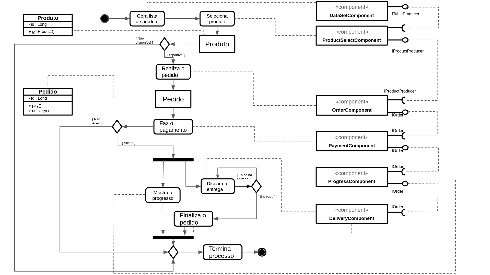
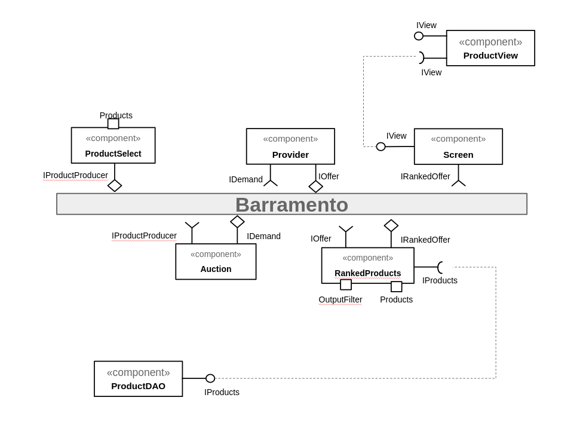

# Tarefa 1

# Tarefa 2

### Sequência:

- O componente **ProductSelect** dispara uma mensagem no tópico IProductProducer que está assinado pelo componente **Auction**;
- Assim que a mensagem é recebida, o componente **Auction** envia uma notificação (mensagem) no tópico **IDemand** que é assinado pelo **Provider**;
- O componente **Provider** identifica que o cliente quer realizar a compra de um produto e envia uma mensagem de oferta no tópico **IOffer**;
- O tópico **IOffer** é assinado pelo componente de rankeamento **RankedProducts** que possui uma propriedade de configuração de seu estado para identificar quantos produtos serão requisitados na saída.  Após realizar o cálculo, o mesmo envia uma mensagem no tópico **IRankedOffer** que é assinado pelo componente **Screen** ;
- O componente **Screen** é utilizado para armazenar as ofertas rankeadas.
# Tarefa 3
> Nenhum produto selecionado 
 
> primeiro produto selecionado 
 
> segundo produto selecionado 
 
> compra de um dos produtos efetiva 
 
> diagrama de blocos do aplicativo 
 