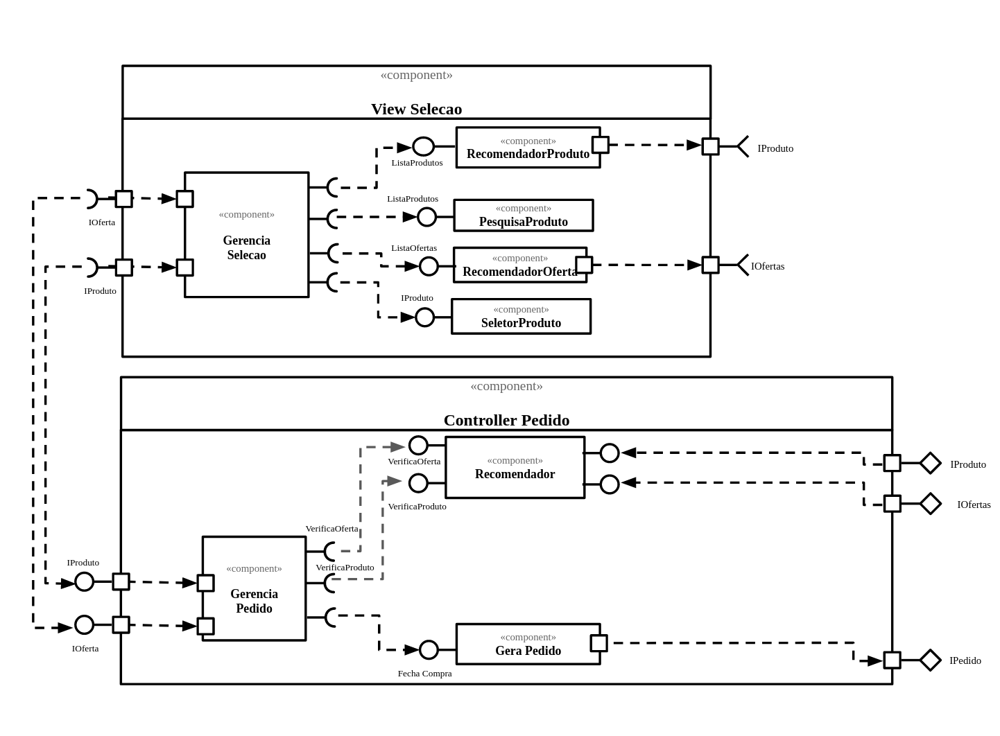

## Tarefa 1
> 

## Tarefa 2
Link para o projeto no Codepen: [React 03 - Componente Barra](https://codepen.io/luanneves07/pen/ExKbXNy)

**HTML**
~~~html

~~~

**CSS**
~~~css
@keyframes dinosaur {
  0%   {background-color:green; left:30px; top:30px;}
  25%  {background-color:brown; left:30px; top:0px;}
  50%  {background-color:yellow; left:30px; top:30px;}
  75%  {background-color:green; left:0px; top:30px;}
  100% {background-color:brown; left:0px; top:30px;}
}

.animated {
  position: relative;
  background-color: red;
  animation-name: dinosaur;
  animation-duration: 4s;
  animation-delay: -4s;
  animation-iteration-count: infinite;
  animation-timing-function: linear;
  animation-direction: alternate;
  width: 5%;
  height: 100%;
}

.rounded {
  flex: 1;
  justify-content: center;
  align-items: center;
  border: 1px solid
  padding: 10px 15px;
  border-radius: 10px;
  font-size: 16px;
}

h2 {
  padding-top: 20px;
}
~~~

**JavaScript**
~~~javascript
class Barra extends React.Component {
  constructor(props) {
    super(props);
    
    this.state = {
      animation: false,
    };
  }
  
  render() {
    let resultado = "";
    for (let b = 1; b <= this.props.tamanho; b++)
      resultado += "=";
    return <>
              
{resultado}

              <button className={this.state.animation && 'animated'}
                onClick={ () => this.setState({animation: !this.state.animation}) }>
                {this.state.animation ? "Desanimar" : "Animar !"}
              </button>
          </>;
  }
}

const elemento = 

                   <h2>O dinossauro</h2>
                   <Barra tamanho="10"/>
                   <h2>pulou na lama.</h2>
                 

ReactDOM.render(elemento, 
        document.getElementById("root"));
~~~
